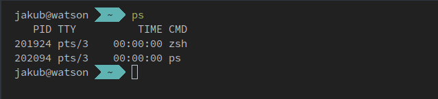

Jakub's Dotfiles
================

My Personal dotfiles.

* Should have minimal prerequisite to get started
* Should be fast to bootstrap and deploy
* Should be modular and flexible for different systems



## Get started
To install the dotfiles on a new system, run the following:

### Prerequisits
You must have `git` and `stow` installed for the rest to work

### Installation
```bash
git clone git@github.com:mandulaj/dotfiles.git .dotfiles && cd .dotfiles
./bootstrap.sh
```
#### Git setup
The git user config is stored separately in `~/.gitconfig.user` please modify as needed:
```gitconfig
[user]
    name = Jakub Mandula
    email = jakub@mandula.cz
```

## Modules

### [bin](./bin)
Various useful bins - this directory is directly in `PATH`
### [alacritty](./alacritty)
- default terminal emulator
### [bash](./bash)
- for backwards compatibility, bash files (load most of the `.aliases`, `.functions`, `.extras` etc.)
### [btop](./btop)
### [emacs](./emacs)
- emacs for personal mind map tracking
### [git](./git)
### [htop](./htop)
### [i3](./i3)
- i3 config
### [nano](./nano)
### [nvim](./nvim)
- default `EDITOR`
### [tmux](./tmux)
### [vim](./vim)
### [wget](./wget)
### [zsh](./zsh)
- Most of zsh config

## Docker test environment
```bash
docker compose build

docker compose run -it dotfiles
```

## Adding new module

1. Create new module folder and touch all the files to be stowed
```bash
mkdir -p new_module/.config/something
touch new_module/.config/something/config.yaml
```
2. Adopt all the files with stow
```bash
stow -v --adopt new_module
```
3. Update the `bootstrap.sh` script and `README.md`

# TODO

- [ ] KiCad
- [ ] ssh
- [ ] Browser (Firefox and Brave)
- [ ] vscode??? Really?

